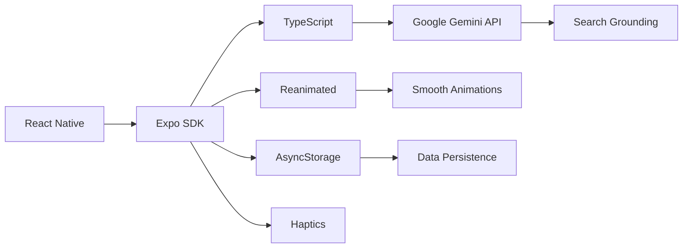

<div align="center">


# Gigi AI Chatbot

### *Your Personal AI Companion with Real-Time Intelligence*

A cutting-edge cross-platform mobile application built with React Native and powered by Google Gemini API, featuring stunning animations, real-time streaming responses, and live web search capabilities.

[](https://reactnative.dev/)
[](https://expo.dev/)
[](https://www.typescriptlang.org/)
[](https://ai.google.dev/)

[📥 Download APK](https://github.com/AJDEV-dotcom/Gigi-AI-Chatbot/releases) • [🎥 Video Demo](https://youtube.com/shorts/j5Vy5vPu4uU?si=RJqjSNet0lPI12_1) • [🐛 Report Bug](https://github.com/AJDEV-dotcom/Gigi-AI-Chatbot/issues)

</div>

---

## 🌟 Highlights

<table>
<tr>
<td width="50%">

### 🚀 **Blazing Fast AI**
Real-time streaming responses powered by Google Gemini API with word-by-word generation for instant, natural conversations.

### 🌐 **Live Web Search**
Integrated Google Search Grounding provides up-to-the-second information on weather, news, and current events.

</td>
<td width="50%">

### 💾 **Smart Persistence**
All conversations automatically saved locally with AsyncStorage - never lose your chat history.

### 🎨 **Stunning UI/UX**
Futuristic design with custom animations, morphing backgrounds, haptic feedback, and pixel-art splash screen.

</td>
</tr>
</table>

---

## ✨ Key Features

<details open>
<summary><b>🤖 AI & Intelligence</b></summary>

- **Real-Time Streaming**: Watch responses generate word-by-word using Gemini's `streamGenerateContent` endpoint
- **Live Web Information**: Get current data on weather, news, stocks, and more through Google Search Grounding
- **Rich Text Support**: Full Markdown rendering with code blocks, lists, bold text, and formatting
- **Context-Aware**: Maintains conversation context for natural, flowing dialogues

</details>

<details open>
<summary><b>💬 Conversation Management</b></summary>

- **Multi-Chat Support**: Create and manage unlimited separate conversations
- **Animated Sidebar**: Beautiful slide-from-left sidebar with smooth animations
- **Easy Navigation**: Quick-switch between conversations with intuitive UI
- **Delete & Archive**: Full control over your conversation history
- **Persistent Storage**: All chats saved locally and restored on app restart

</details>

<details open>
<summary><b>🎨 Design & Animation</b></summary>

- **Custom Splash Screen**: Netflix-style pixel dispersal animation built with Reanimated
- **Dynamic Backgrounds**: Morphing orbs that react and transform during AI generation
- **Haptic Feedback**: Tactile responses using `expo-haptics` for enhanced interaction
- **Custom Typography**: Futuristic "Orbitron" font throughout the app
- **Themed Components**: Custom modals, buttons, and UI elements for cohesive design
- **Smooth Transitions**: 60fps animations powered by React Native Reanimated

</details>

---

## 📸 Screenshots

<div align="center">

| Splash Screen | Chat Interface | Sidebar Menu |
|:---:|:---:|:---:|
|  |  |  |
| Pixel-art animation on launch | Real-time streaming responses | Manage multiple conversations |

</div>

---

## 🛠️ Tech Stack



<table>
<tr>
<th>Category</th>
<th>Technology</th>
<th>Purpose</th>
</tr>
<tr>
<td><b>Framework</b></td>
<td>React Native (Expo)</td>
<td>Cross-platform mobile development</td>
</tr>
<tr>
<td><b>Language</b></td>
<td>TypeScript</td>
<td>Type-safe development</td>
</tr>
<tr>
<td><b>AI Backend</b></td>
<td>Google Gemini API</td>
<td>Advanced AI conversations with web search</td>
</tr>
<tr>
<td><b>Animations</b></td>
<td>React Native Reanimated</td>
<td>60fps native animations</td>
</tr>
<tr>
<td><b>Navigation</b></td>
<td>Expo Router</td>
<td>File-based routing system</td>
</tr>
<tr>
<td><b>Storage</b></td>
<td>AsyncStorage</td>
<td>Persistent local data</td>
</tr>
<tr>
<td><b>UI Polish</b></td>
<td>expo-haptics, react-native-marked</td>
<td>Enhanced user experience</td>
</tr>
<tr>
<td><b>Build Service</b></td>
<td>Expo Application Services (EAS)</td>
<td>Cloud builds & deployment</td>
</tr>
</table>

---

## 📥 Installation

### Option 1: Download APK (Android Users)

1. Visit the [**Releases Page**](https://github.com/AJDEV-dotcom/Gigi-AI-Chatbot/releases)
2. Download the latest `Gigi-AI-Chatbot.apk`
3. Enable "Install from unknown sources" in your Android settings if prompted
4. Install and launch the app
5. Start chatting with Gigi! 🎉

### Option 2: Build from Source (Developers)

#### Prerequisites

- Node.js (v16 or higher)
- npm or yarn
- Expo CLI
- Android Studio / Xcode (for native builds)
- Google Gemini API Key ([Get one here](https://ai.google.dev/))

#### Steps

1. **Clone the repository**
   ```bash
   git clone https://github.com/AJDEV-dotcom/Gigi-AI-Chatbot.git
   cd Gigi-AI-Chatbot
   ```

2. **Install dependencies**
   ```bash
   npm install
   # or
   yarn install
   ```
   
   > 💡 **Tip**: Run `npx expo install` to ensure all native library versions are compatible

3. **Configure API Key**
   
   Create a file named `env.js` in the project root:
   ```javascript
   export const GEMINI_API_KEY = "YOUR_GEMINI_API_KEY_HERE";
   ```

4. **Start the development server**
   ```bash
   npx expo start -c
   ```

5. **Run on your device**
   - Scan the QR code with Expo Go app (iOS/Android)
   - Press `a` for Android emulator
   - Press `i` for iOS simulator

---

## 🎯 Usage

1. **Start a New Chat**: Tap the "+" button or use the sidebar
2. **Ask Anything**: Type your question and watch the AI respond in real-time
3. **Switch Conversations**: Open the sidebar to navigate between chats
4. **Get Live Info**: Ask about current weather, news, or events for real-time data
5. **Manage History**: Long-press conversations to delete or archive

---

## 🏗️ Project Structure

```
Gigi-AI-Chatbot/
├── app/                    # Expo Router pages
├── assets/                 # Images, fonts, and static files
├── components/             # Reusable React components
├── utils/                  # Helper functions and utilities
├── env.js                  # API configuration (create this)
├── app.json               # Expo configuration
└── package.json           # Dependencies
```

---

## 🤝 Contributing

Contributions are what make the open-source community amazing! Any contributions you make are **greatly appreciated**.

1. Fork the Project
2. Create your Feature Branch (`git checkout -b feature/AmazingFeature`)
3. Commit your Changes (`git commit -m 'Add some AmazingFeature'`)
4. Push to the Branch (`git push origin feature/AmazingFeature`)
5. Open a Pull Request

---

## 🙏 Acknowledgments

- [Google Gemini API](https://ai.google.dev/) for powerful AI capabilities
- [Expo](https://expo.dev/) for excellent React Native tooling
- [React Native Reanimated](https://docs.swmansion.com/react-native-reanimated/) for smooth animations
- All contributors and users of this project

---

## 📧 Contact & Support

**Developer**: AJDEV

- GitHub: [@AJDEV-dotcom](https://github.com/AJDEV-dotcom)
- Project Link: [https://github.com/AJDEV-dotcom/Gigi-AI-Chatbot](https://github.com/AJDEV-dotcom/Gigi-AI-Chatbot)

**Found a bug?** [Open an issue](https://github.com/AJDEV-dotcom/Gigi-AI-Chatbot/issues)

**Have questions?** [Start a discussion](https://github.com/AJDEV-dotcom/Gigi-AI-Chatbot/discussions)

---

<div align="center">

### ⭐ Star this repo if you find it helpful!

**Made with ❤️ by AJDEV**


</div>
